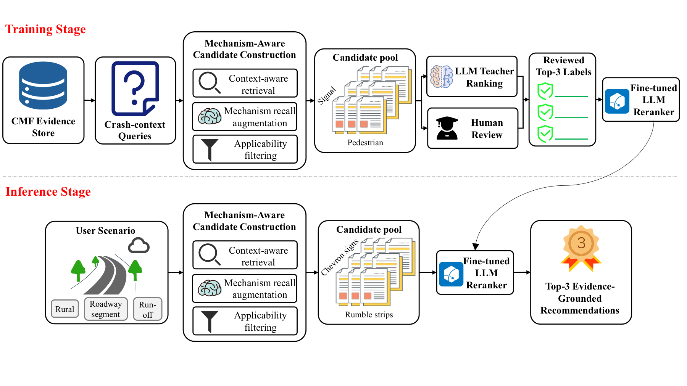
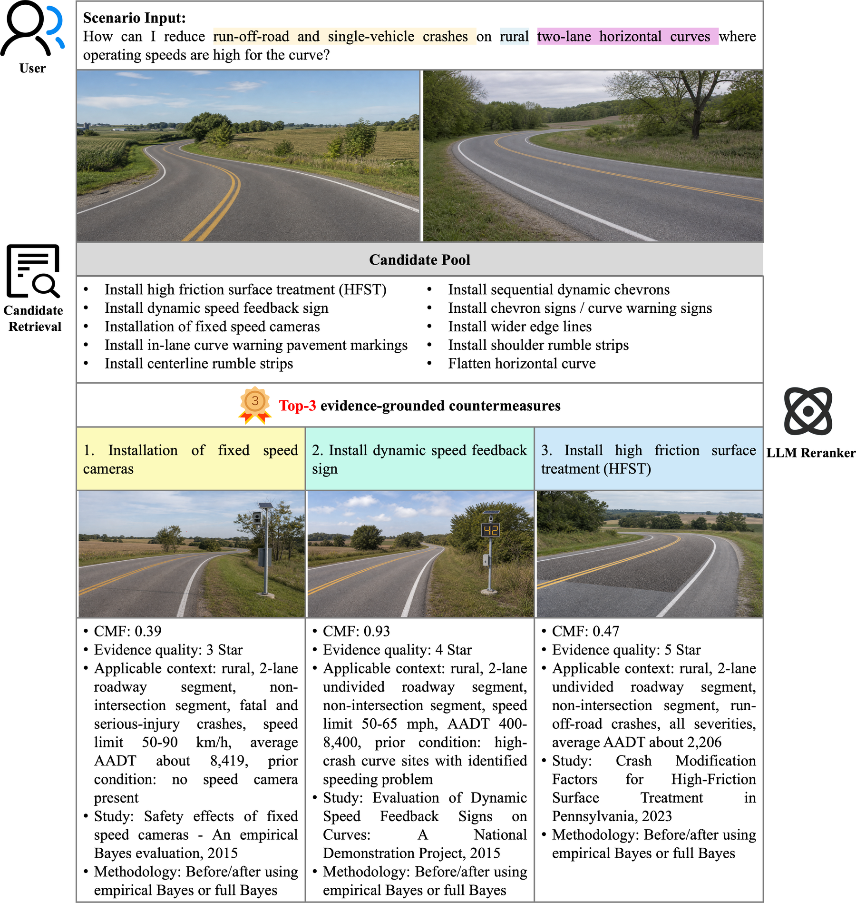

# CMF Evidence-Grounded Countermeasure Recommendation

This repository contains an evidence-grounded framework for traffic safety
countermeasure recommendation. The system converts a natural-language crash
scenario into a constrained pool of CMF evidence cards, then uses a fine-tuned
LLM reranker to select traceable evidence IDs from that pool.

The key design choice is to recommend CMF evidence cards rather than free-form
countermeasure text. Each selected evidence ID can be mapped back to a
countermeasure name, CMF/CRF value, evidence quality, applicability conditions,
and literature source.

## Framework



## Example Case

The example below illustrates how a crash-context question is mapped to a
candidate countermeasure pool and then reranked into evidence-grounded Top-3
recommendations.



## What Is Included

- Core utilities for representing CMF records as structured evidence cards.
- Candidate evidence construction with context-based scoring, mechanism-aware
  augmentation, and engineering applicability filtering.
- Data formatting and evaluation scripts for candidate-constrained LLM reranking.
- A framework figure and lightweight demo utilities for illustrating the
  retrieval-reranking workflow.

## Data Availability

This repository includes:

- `data/evidence_store.jsonl`: 8,844 structured CMF evidence cards.
- `data/release/README.md`: schema notes for the reviewed reranking dataset.
- `data/release/manifest.json`: metadata for the reviewed reranking dataset.

The reviewed reranking dataset contains 2,150 query-label examples in the
experimental setup, with 1,827 training examples, 108 validation examples, and
215 test examples. Its two-file organization is:

```text
data/release/reviewed_rerank_examples.jsonl
data/release/sft_top20_examples.jsonl
```

`reviewed_rerank_examples.jsonl` contains one row per reviewed crash-context
query, including the query text, target context, source evidence ID, and reviewed
Top-K reference labels. `sft_top20_examples.jsonl` contains one row per
model-ready SFT example, including the train/dev/test split field, compact Top-20
candidate evidence pool, and JSON target output. The separate `evidence_store`
remains the evidence fact table used for citation and CMF/CRF backfill.

## Task Formulation

For each crash-context query `q`, the system constructs a candidate evidence pool
`C(q)` from the CMF evidence store. The reranker outputs an ordered list of up to
three evidence IDs:

```json
{
  "recommendations": [
    {"rank": 1, "evidence_ids": ["..."]},
    {"rank": 2, "evidence_ids": ["..."]},
    {"rank": 3, "evidence_ids": ["..."]}
  ]
}
```

The model is constrained to choose IDs from the provided candidate pool. It does
not generate new CMF values, CRF values, star ratings, or citations. Those fields
are deterministically backfilled from `data/evidence_store.jsonl`.

## Candidate Evidence Construction

Candidate construction has three main stages:

1. Context-based retrieval scoring.
2. Mechanism-aware recall augmentation.
3. Engineering applicability filtering.

The retrieval score is implemented as a multiplicative utility score:

```text
S_ret(q, e) = M(q, e)^lambda * E(e) * W(e)
```

where `M(q, e)` is the context-match score, `E(e)` is the safety-effect utility,
`W(e)` is the evidence-quality weight, and `lambda = 1.0` in the current
implementation.

Mechanism-aware augmentation supplements evidence cards associated with
improvement mechanisms implied by the query context, such as nighttime
visibility, curve delineation, lane-departure control, pedestrian crossing
treatments, bicycle facility treatments, access management, median protection,
speed management, signal visibility, left-turn operation, frontage-road
operation, and toll-plaza operation.

Engineering applicability filtering removes candidates with clear facility,
traffic-control, crash-mechanism, roadway-geometry, hidden-prerequisite, or
negative-effect conflicts.

## Quick Start

Use Python 3.10 or newer. Most retrieval and data inspection scripts rely on the
standard library plus the local `cmfrec` package. Data-dependent scripts require
the dataset files at the paths described above. When running scripts directly,
set `PYTHONPATH=.`:

```bash
cd /path/to/this/repository
PYTHONPATH=. python3 scripts/build_retrieval_demo_web.py
```

If the release data are available locally, inspect them with:

```bash
python3 - <<'PY'
import json
from pathlib import Path

for path in [
    "data/evidence_store.jsonl",
    "data/release/reviewed_rerank_examples.jsonl",
    "data/release/sft_top20_examples.jsonl",
]:
    p = Path(path)
    print(path, sum(1 for _ in p.open()))
PY
```

If the local test data and prediction files are available, build the mentor demo
webpage with:

```bash
PYTHONPATH=. python3 scripts/build_retrieval_demo_web.py
```

The generated demo is written to:

```text
out/mentor_retrieval_demo_current/index.html
```

## Training Notes

The release SFT files are already formatted for candidate-constrained supervised
fine-tuning. The training examples use compact Top-20 evidence cards to control
context length.

Model training can be conducted on GPU machines using open-source LLM backbones
and parameter-efficient fine-tuning.

For GPU training, install the appropriate CUDA-compatible PyTorch build for your
machine, then install typical SFT dependencies such as:

```text
transformers
datasets
accelerate
peft
trl
safetensors
```

## Evaluation

The evaluation framework compares model outputs against reviewed reference
labels at multiple levels:

- Evidence-level agreement: exact CMF evidence ID match.
- Countermeasure-level agreement: same or highly similar countermeasure text.
- Mechanism-level agreement: same safety-improvement mechanism.
- Engineering bad-fit rate: recommendations with clear engineering
  applicability conflicts.

LLM-assisted and independent expert reviews can also be used to score context
fit, mechanism consistency, engineering applicability, and overall usefulness on
a 1-5 scale.
